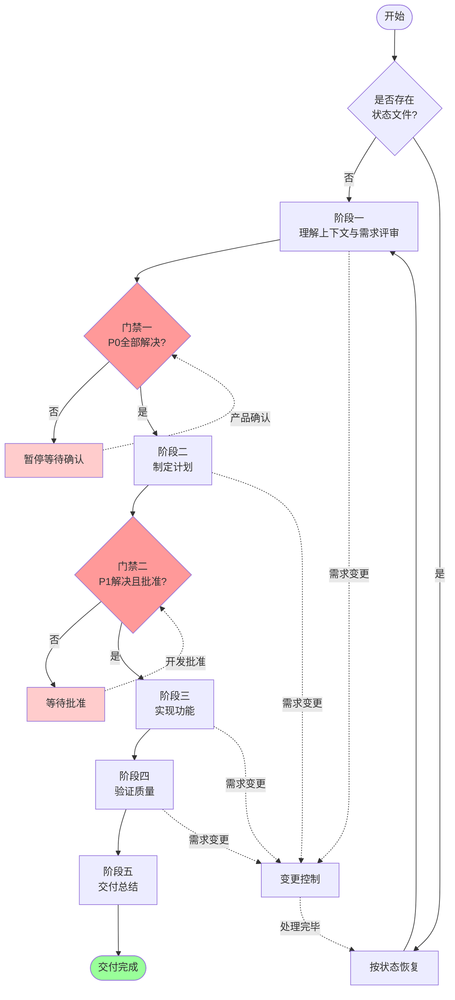
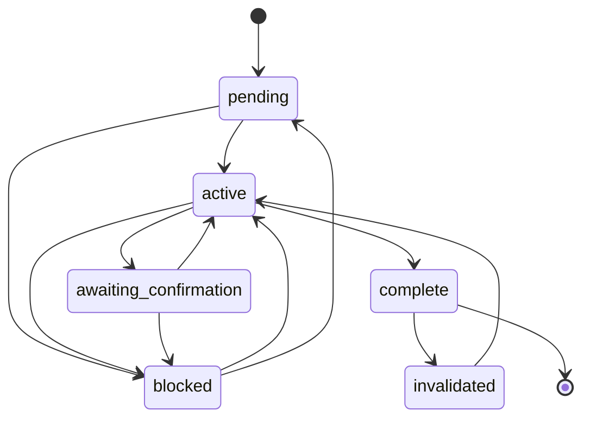
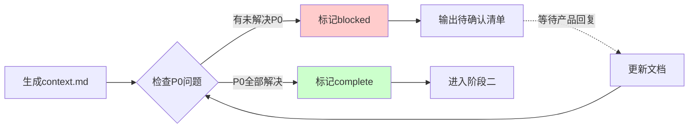
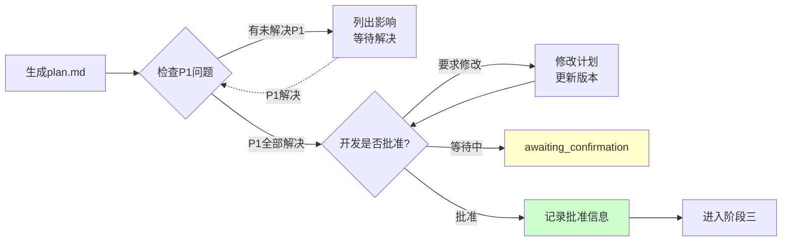
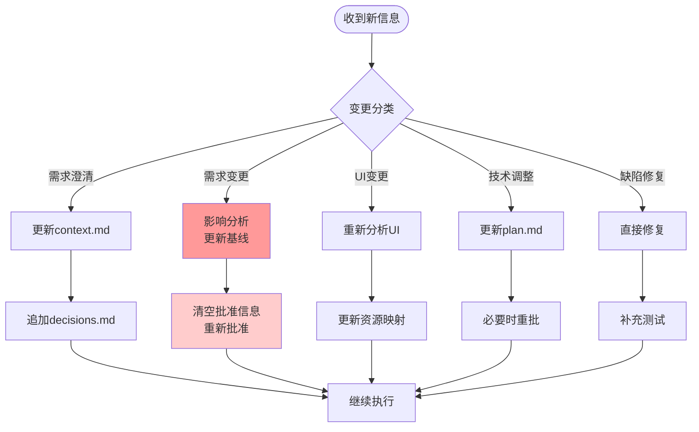
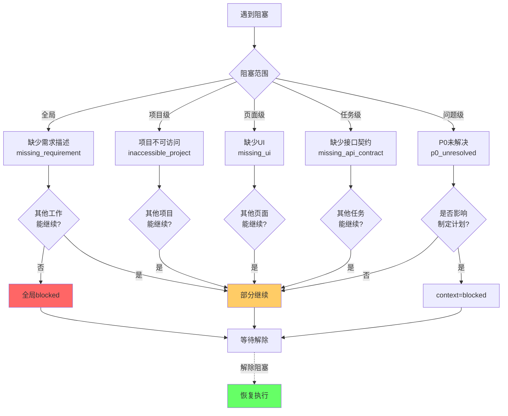
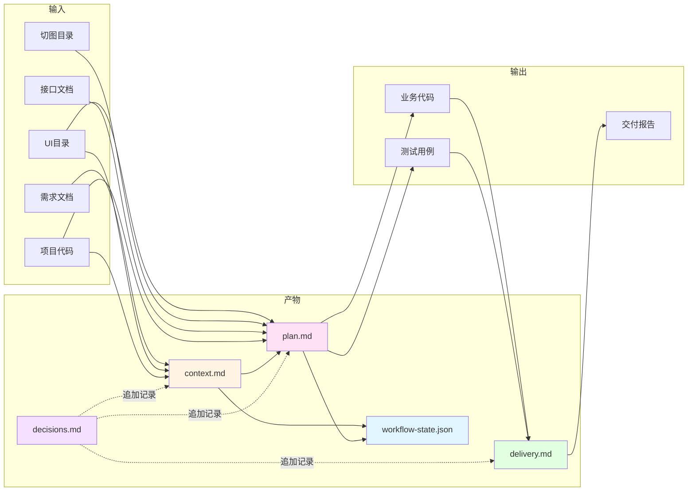
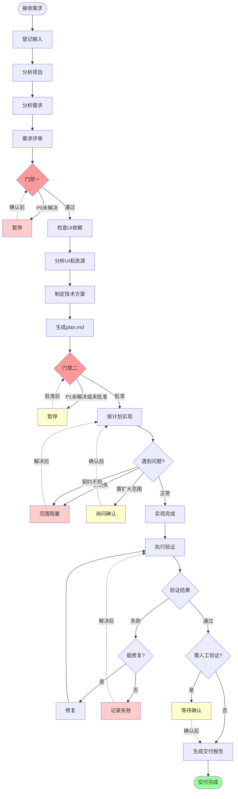

# Frontend Delivery 工作流程图

## 1. 五阶段总览

## 2. 状态机转换

## 3. 门禁一：需求确认

## 4. 门禁二：计划批准

## 5. 变更分类决策树

## 6. 阻塞范围控制

## 7. 产物文件关系

## 8. 完整执行流程（含异常路径）

---

## 说明

1. **简化设计**：将原来的超大图拆分成 8 个独立图表，每个聚焦一个核心流程
2. **避免节点冲突**：每个图表使用独立的节点 ID（A1, B1, C1 等）
3. **清晰的视觉层次**：
   - 红色：门禁和关键决策
   - 黄色：等待确认
   - 粉色：阻塞状态
   - 绿色：完成状态
4. **渐进式阅读**：从总览到细节，从状态机到具体流程

每个图表都可以独立渲染，适合在文档、GitHub、Obsidian 等工具中查看。
