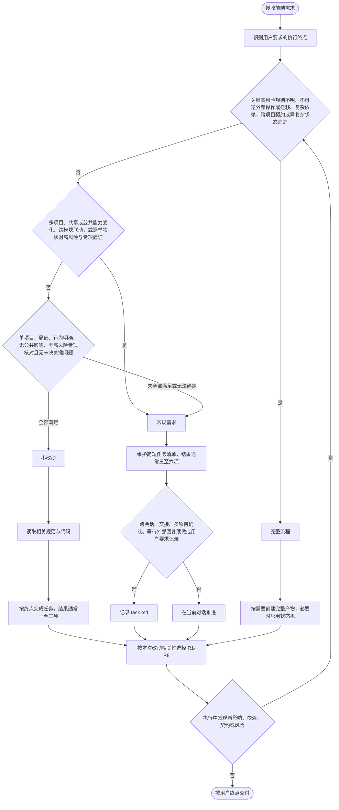
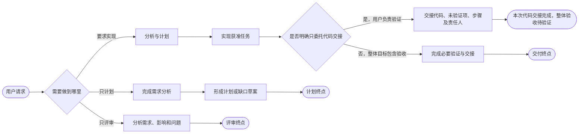
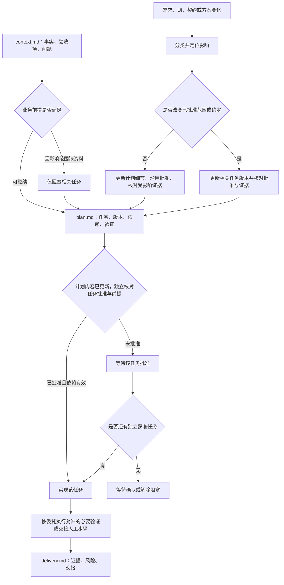
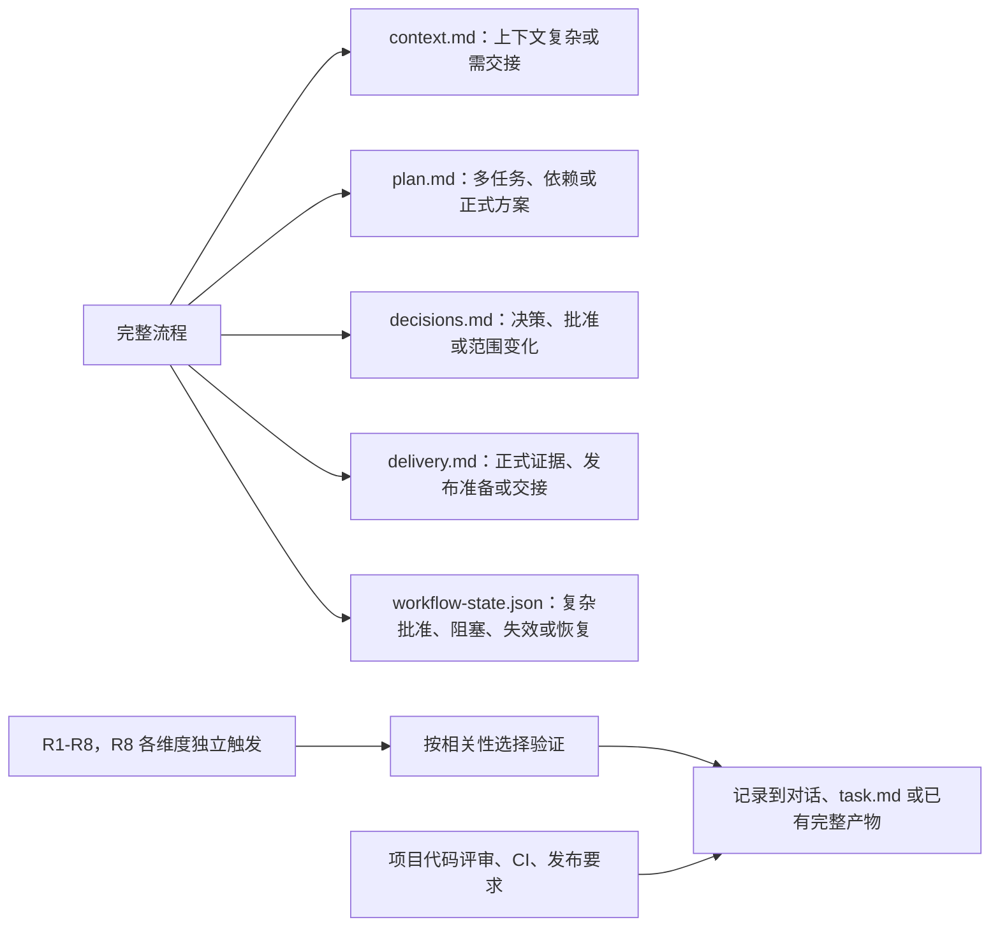
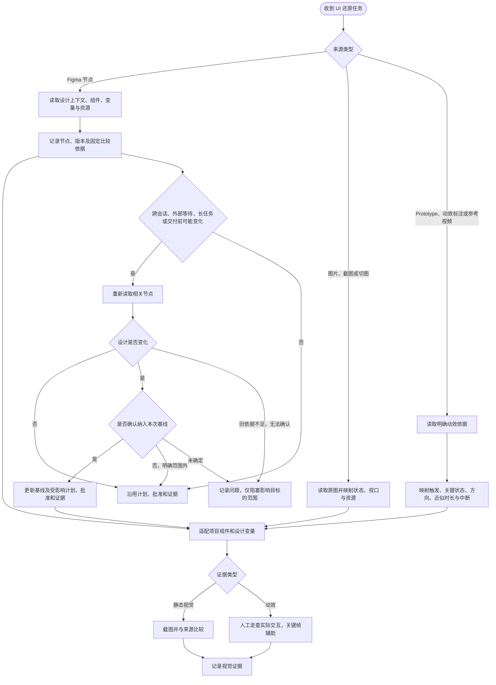
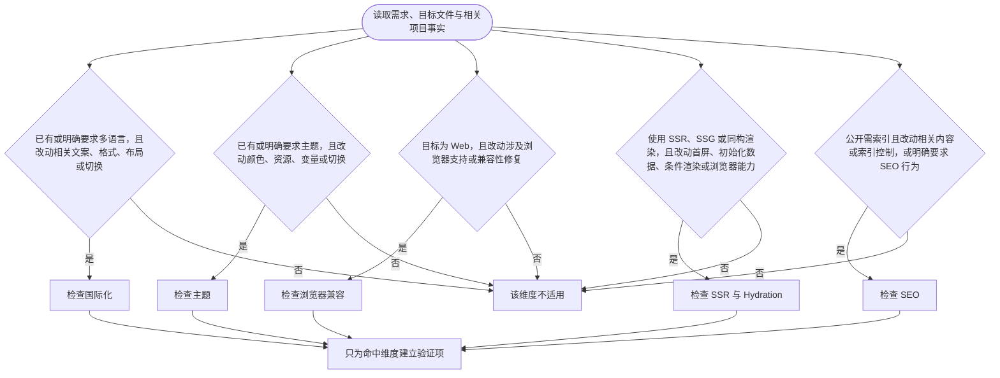

# Frontend Delivery v2.0.0 工作流程图

本图对应 frontend-delivery v2.0.0。执行规则以同版本 SKILL.md 及 references/ 为准。

2.0.0 汇总三级分流、独立风险检查、按需产物、UI 与动效还原、实现交接，以及执行中的重新判断。

## 1. 流程深度选择

## 2. 执行终点

## 3. 完整流程与任务级批准

## 4. 按需产物与独立风险职责

## 5. UI、动效与 Figma 来源闭环

## 6. R8 条件性风险独立触发

## 使用说明

- 从流程深度开始，只进入当前任务需要的路径。
- 风险检查按本次改动相关性独立叠加，项目存在某项能力或出现关键词不自动触发。
- 执行终点由用户请求决定，不因使用完整流程自动扩大授权。
- 状态、批准、风险和证据的详细规则以同版本参考文件为准。
